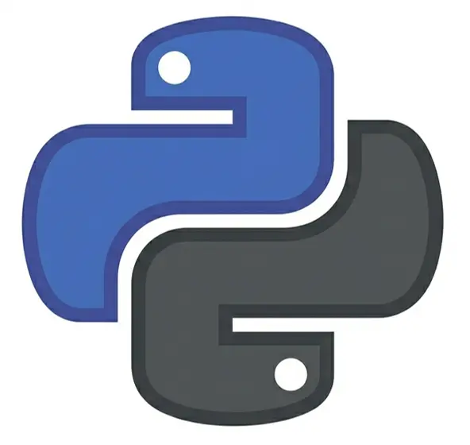

::: {.text-start}
# The Complete Course Portfolio
:::

 

::: {.course-grid}

::: {.card .p-5 .text-center .shadow-sm .card-flex}
::: {.flex-grow-1}
##  Excel Course
Learn to handle data with confidence, build clean spreadsheets, and master the tools you'll actually need in a professional office environment.
:::

[View Course Details](excel/index.qmd){.btn .btn-lg .btn-custom}
:::

::: {.card .p-5 .text-center .shadow-sm .card-flex}
::: {.flex-grow-1}
##  Python Course
Master the world's most popular language for data science. From basics to advanced data manipulation with Pandas.
:::

[View Course Details](python/index.qmd){.btn .btn-lg .btn-custom}
:::

::: {.card .p-5 .text-center .shadow-sm .card-flex}
::: {.flex-grow-1}
##  Agentic Engineering
Learn to build software at the speed of thought. Master LLMs, AI-assistants, and modern developer workflows.
:::

[View Course Details](agentic_engineering/index.qmd){.btn .btn-lg .btn-custom}
:::

:::

