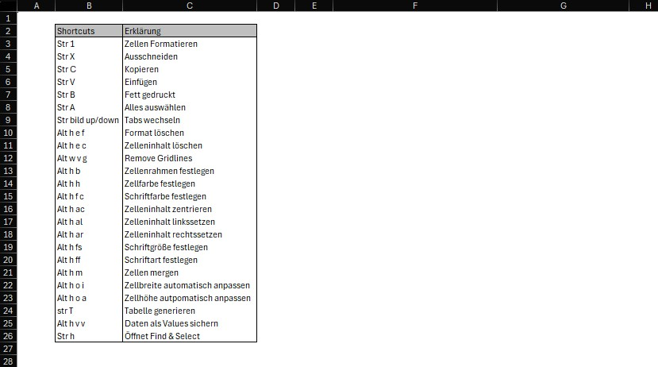

::: {.content-block}
:::: {.columns}

::: {.column width="45%"}
### Excel Grundlagen
Excel Grundlagen: Formeln - Formatierung - Datenanalyse

::: {.card .shadow-sm .p-3}
{.border .rounded .mb-3}

[Download PDF](../../../files/Excel_Grundlagen.pdf){.btn .btn-outline-primary .w-100 role="button" target="_blank"}
:::
:::

::: {.column width="10%"}
:::

::: {.column width="45%"}
### Excel Aufgaben
Excel Aufgaben und Übungen zur Vertiefung der Grundlagen

::: {.card .shadow-sm .p-3}
{.border .rounded .mb-3}
    
[Download Excel](../../../files/Excel_Aufgaben.xlsx){.btn .btn-outline-primary .w-100 role="button" target="_blank"}
:::
:::

::::
:::